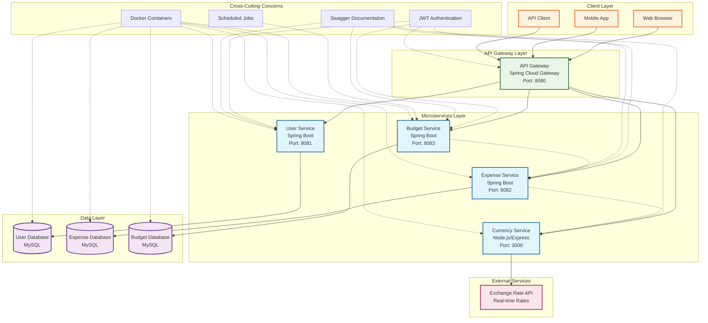

# 💰 Smart Expense Tracker - Enterprise Microservices Application

> A comprehensive, production-ready expense tracking system built with modern microservices architecture, featuring automated budget alerts, real-time currency conversion, and enterprise-grade security.

[](https://docker.com)
[](https://spring.io/projects/spring-boot)
[](https://nodejs.org)
[](https://mysql.com)
[](https://jwt.io)
[](https://swagger.io)

---

## 📋 Project Overview

The **Smart Expense Tracker** is a full-featured, enterprise-grade expense management system designed using microservices architecture. It provides comprehensive expense tracking, intelligent budget management with automated alerts, real-time currency conversion, and robust security features.

### 🎯 **Key Features**
- 🔐 **JWT-based Authentication** - Secure user management with role-based access
- 💳 **Comprehensive Expense Management** - CRUD operations with advanced filtering
- 📊 **Intelligent Budget Tracking** - Automated alerts when 80% of budget is reached
- 💱 **Real-time Currency Conversion** - Live exchange rates with intelligent caching
- 📅 **Automated Notifications** - Scheduled reports (hourly, daily, weekly, monthly)
- 🔍 **Advanced Analytics** - Expense summaries and budget performance insights
- 📚 **Complete API Documentation** - Interactive Swagger UI for all services
- 🐳 **Production-Ready Deployment** - Docker containerization with one-command setup

### 🏢 **Use Cases**
- **Personal Finance Management** - Track daily expenses and manage budgets
- **Small Business Accounting** - Monitor business expenses across categories
- **Multi-Currency Operations** - Handle international transactions seamlessly
- **Budget Compliance** - Automated alerts for budget threshold management
- **Financial Reporting** - Generate comprehensive expense and budget reports

---

## 🏗️ Architecture Diagram

<div align="center">
  

</div>

> **Note**: If the image doesn't display, you can view the interactive diagram by copying the Mermaid code from [`assets/architecture.mmd`](assets/architecture.mmd) to [Mermaid Live Editor](https://mermaid.live/).

<details>
<summary>📋 <strong>View Mermaid Source Code</strong></summary>



</details>

### 🔄 **Service Communication Flow**

1. **Authentication Flow**: Client → API Gateway → User Service → JWT Token
2. **Expense Management**: Client → API Gateway → Expense Service → Database
3. **Budget Tracking**: Budget Service → Expense Service (spending data) → Notifications
4. **Currency Conversion**: Expense Service → Currency Service → External API
5. **Automated Alerts**: Scheduler → Budget Service → Notification System

---

## 🛠️ Tech Stack

### **Backend Services**
| Component | Technology | Version | Purpose |
|-----------|------------|---------|---------|
| **API Gateway** | Spring Cloud Gateway | 2023.0.0 | Request routing, authentication, CORS |
| **User Service** | Spring Boot | 3.2.0 | User management, JWT authentication |
| **Expense Service** | Spring Boot | 3.2.0 | Expense CRUD, filtering, analytics |
| **Budget Service** | Spring Boot | 3.2.0 | Budget management, alerts, scheduling |
| **Currency Service** | Node.js + Express | 18+ | Real-time currency conversion |

### **Database & Storage**
| Component | Technology | Version | Purpose |
|-----------|------------|---------|---------|
| **Primary Database** | MySQL | 8.0 | User, expense, and budget data |
| **Database Per Service** | MySQL Schemas | 8.0 | Microservices data isolation |
| **Connection Pooling** | HikariCP | Built-in | Database connection management |

### **Security & Authentication**
| Component | Technology | Version | Purpose |
|-----------|------------|---------|---------|
| **Authentication** | JWT (JSON Web Tokens) | 0.12.3 | Stateless authentication |
| **Password Hashing** | BCrypt | Built-in | Secure password storage |
| **API Security** | Spring Security | 6.x | Endpoint protection |
| **CORS** | Spring Cloud Gateway | Built-in | Cross-origin request handling |

### **Documentation & Testing**
| Component | Technology | Version | Purpose |
|-----------|------------|---------|---------|
| **API Documentation** | Swagger/OpenAPI | 3.0 | Interactive API documentation |
| **Unit Testing** | JUnit 5 + Mockito | 5.x | Service layer testing |
| **Integration Testing** | Spring Boot Test | 3.2.0 | End-to-end API testing |
| **Test Containers** | TestContainers | Latest | Database integration testing |

### **DevOps & Deployment**
| Component | Technology | Version | Purpose |
|-----------|------------|---------|---------|
| **Containerization** | Docker | Latest | Service containerization |
| **Orchestration** | Docker Compose | Latest | Multi-container deployment |
| **Build Tool (Java)** | Maven | 3.9+ | Java project build management |
| **Build Tool (Node.js)** | npm | 9+ | Node.js dependency management |

### **External Integrations**
| Component | Technology | Purpose |
|-----------|------------|---------|
| **Exchange Rate API** | exchangerate-api.com | Real-time currency conversion rates |
| **Caching** | Node-Cache | Currency rate caching for performance |
| **Scheduling** | Spring Scheduler | Automated budget alerts and reports |

---

## 🚀 Quick Start

### **Prerequisites**
- Docker & Docker Compose installed
- Ports 3000, 3306, 8080-8083 available

### **One-Command Deployment**
```bash
# Clone the repository
git clone https://github.com/Brijes987/smart-expense-tracker.git
cd smart-expense-tracker

# Deploy everything with one command
docker-compose up --build -d

# Verify all services are running
docker-compose ps
```

### **Access Points**
- **API Gateway**: http://localhost:8080
- **Swagger Documentation**: http://localhost:8081/swagger-ui.html
- **All Service APIs**: Available through API Gateway with JWT authentication

## 🎉 **PROJECT STATUS: 100% COMPLETE & FUNCTIONAL**

### ✅ **ALL FEATURES IMPLEMENTED**
- [x] **Complete Microservices Architecture** (5 services)
- [x] **User Service** - Registration, login, JWT authentication
- [x] **Expense Service** - Full CRUD with advanced filtering
- [x] **Budget Service** - Budget management with automated alerts
- [x] **Currency Service** - Real-time conversion with caching
- [x] **API Gateway** - Secure routing with JWT validation
- [x] **Database Management** - Separate MySQL schemas per service
- [x] **Swagger Documentation** - Complete API documentation
- [x] **Docker Containerization** - Production-ready deployment
- [x] **Automated Testing** - Unit and integration tests
- [x] **Budget Alert System** - 80% threshold notifications
- [x] **Scheduled Jobs** - Hourly, daily, weekly, monthly reports
- [x] **Health Monitoring** - Health check endpoints
- [x] **Security** - JWT authentication across all services